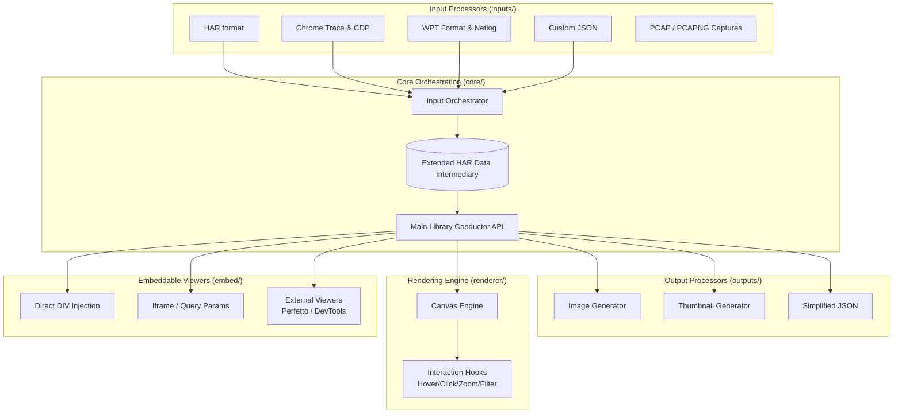

# Waterfall Tools Architecture

## Overview
The Waterfall Tools library is a highly performant, modular, client-side Vanilla JavaScript library for generating, viewing, and analyzing network waterfalls and filmstrips. It takes inspiration from WebPageTest, with an emphasis on performance, zero-bloat, and extensibility.

## Core Principles
- **Intermediary Data Format**: Everything standardizes to an Extended HAR (HTTP Archive) format.
- **Pluggability**: Input processors, output generators, and embeddable viewers are isolated and selectable.
- **Client-Rendered**: Canvas-based rendering with Vanilla JS for optimal performance.
- **Environment Agnostic**: Supports both Browser and Node.js environments where applicable.

## High-Level Architecture



## Directory Structure

```text
/
├── bin/                # CLI entry points and binary wrappers
│   └── waterfall-tools.js # Main CLI executable pulling from Core
├── src/
│   ├── inputs/             # Self-contained modules for processing specific input formats
│   │   ├── cli/            # Standalone CLI tools testing & generating Extended HARs
│   │   ├── utilities/      # Internal parsing pipelines & decoupled bin protocol helpers
│   │   │   └── tcpdump/    # Deep packet inspection modular helpers (TLS, QUIC, TCP/UDP)
│   │   ├── har.js          # Standard HAR passthrough
│   │   ├── chrome-trace.js
│   │   ├── wpt-json.js     # WebPageTest pipeline
│   │   ├── netlog.js       # Raw Chrome proxy tracker
│   │   ├── cdp.js          # Chrome DevTools network protocols
│   │   ├── tcpdump.js      # Processes PCAP/PCAPNG packets
│   │   └── orchestrator.js # API for converting chosen input to intermediary HAR
│   ├── outputs/            # Modules for generating various output formats
│   │   ├── image.js        # Waterfall image generation
│   │   ├── thumbnail.js    # Thumbnail generation
│   │   └── simple-json.js  # Simplified request data
│   ├── renderer/           # Waterfall canvas rendering logic
│   │   ├── canvas.js       # Core rendering loop
│   │   ├── layout.js       # Positioning and geometry calculations
│   │   └── interaction.js  # Hooks for hover, click, zoom, filtering
│   ├── embed/              # Website embedding support
│   │   ├── div-embed.js    # DIV + URL/Data embedding
│   │   ├── iframe-embed.js # Iframe query param handling
│   │   └── external/       # Wrappers for Perfetto, Chrome DevTools
│   ├── core/               # Shared logic, schemas, and main library conductor
│   │   ├── har-types.js    # Extended HAR conventions
│   │   └── conductor.js    # Main API interface
│   ├── platforms/          # Environment-specific implementations (e.g., File I/O vs Fetch)
│   │   ├── browser/
│   │   └── node/
│   └── filmstrip/          # (Future) Filmstrip and screenshot processing
├── Sample/                 # Sample files and reference implementations
│   ├── Data/               # Sample input files grouped by format (e.g., HAR/source1)
│   └── Implementations/    # Sample python parsing implementations by format
```

## CLI Modes and Testing
Each input format processor acts as an independent module that includes a **stand-alone CLI mode**. The CLI takes a single input file format and generates an output file in the intermediary Extended HAR format. This standalone mode doubles as the primary testing vector: automated tests parse known sample data and assert that the CLI-generated outputs strictly match known-good Extended HAR outputs (after an initial baseline is captured).

## Intermediary Data Format (Extended HAR)
The library uses the standard HAR 1.2 format as a base. Any application-specific data extracted from non-HAR formats (such as Chrome Traces or WPT data) will be stored in fields prefixed with an underscore (`_`), per the HAR specification allowance for custom fields. 

Example:
```json
{
  "log": {
    "version": "1.2",
    "creator": {
      "name": "waterfall-tools",
      "version": "x.x.x"
    },
    "entries": [
      {
        "startedDateTime": "2023-10-01T12:00:00.000Z",
        "time": 50,
        "request": { ... },
        "response": { ... },
        "_initiator": "script.js",
        "_renderBlocking": true,
        "_connectionReused": false
      }
    ]
  }
}
```

## Rendering Engine
The renderer uses the native HTML5 `<canvas>` API rather than the DOM (e.g., creating hundreds of `<div>` tags) to ensure that rendering thousands of requests doesn't cause browser layout trashing. Interaction is handled by maintaining a spatial index of drawn elements and mapping mouse coordinates to data entries. Application logic overrides can be supplied via robust hook events system injected into the render core.

## Embeddable Components
The architecture natively accommodates integration directly securely into web apps. Input properties such as DIV identifiers or base URLs are injected smoothly to instantiate full viewers. IFrame configurations rely on structured message passing or parsed query parameters for headless integration with data resources. 

## Build and Bundling
The project should use a modern bundler like Vite or Rollup to package the library into modular ES Modules (ESM) and Universal Module Definition (UMD). The configuration must strictly support tree-shaking, removing irrelevant target platforms and components statically—so a web integration need only load the browser-renderer subsets minus node endpoints. Native APIs are favored, seamlessly scaling up to WASM when computationally expensive image/video evaluations are invoked.
