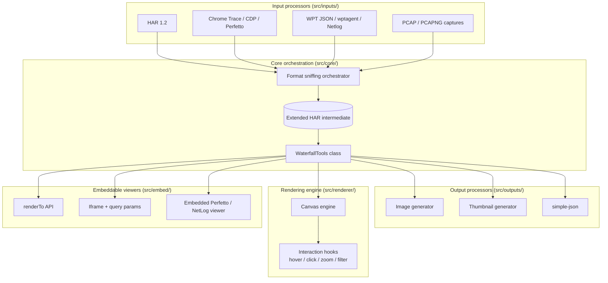

# Waterfall Tools Architecture

## Overview

Waterfall Tools is a high-performance, modular Vanilla JavaScript library for generating, viewing, and analyzing network waterfalls and filmstrips. It takes its visual conventions from WebPageTest and prioritizes zero bloat, extensibility, and raw rendering speed.

## Core principles

- **One intermediate format.** Every input is normalized to an Extended HAR (HTTP Archive) payload before it touches renderers or output modules.
- **Pluggable.** Input parsers, output generators, and embed targets are isolated modules — consumers only pay for what they use, and bundlers can tree-shake the rest.
- **Client-rendered.** Canvas-based rendering in Vanilla JS. No framework, no DOM-per-request.
- **Isomorphic.** The core runs the same code path in the browser and Node.js. Environment-specific shims are dynamically imported.

## High-level architecture



## Directory structure

```text
/
├── bin/
│   └── waterfall-tools.js            # Unified CLI
├── src/
│   ├── inputs/                        # Input format processors
│   │   ├── cli/                       # Per-format CLI wrappers (Node-only)
│   │   ├── utilities/                 # Internal parsers / binary protocol helpers
│   │   │   └── tcpdump/               # Deep packet inspection (TLS, QUIC, TCP/UDP, HPACK, QPACK)
│   │   ├── har.js                     # HAR passthrough
│   │   ├── chrome-trace.js            # Chrome DevTools Trace → Extended HAR
│   │   ├── perfetto.js                # Perfetto protobuf (pure-JS)
│   │   ├── wpt-json.js                # WebPageTest JSON
│   │   ├── wptagent.js                # wptagent ZIP archives
│   │   ├── netlog.js                  # Chrome Netlog
│   │   ├── cdp.js                     # Chrome DevTools Protocol events
│   │   ├── tcpdump.js                 # PCAP / PCAPNG
│   │   └── orchestrator.js            # Format sniffing + routing
│   ├── outputs/
│   │   ├── image.js                   # Waterfall image export
│   │   ├── thumbnail.js               # Thumbnail export
│   │   └── simple-json.js             # Flattened 1D request array
│   ├── renderer/
│   │   ├── canvas.js                  # Core render loop
│   │   ├── layout.js                  # Row layout + geometry
│   │   └── interaction.js             # Hover / click / zoom / filter hooks
│   ├── embed/
│   │   ├── iframe-embed.js            # Iframe query-param wiring
│   │   └── external/                  # Perfetto / NetLog viewer wrappers
│   ├── core/
│   │   ├── waterfall-tools.js         # Main WaterfallTools class
│   │   ├── har-converter.js           # HAR ↔ internal shape
│   │   ├── har-types.js               # JSDoc type definitions
│   │   └── decompress.js              # Content-encoding decoders
│   ├── viewer/                        # Standalone full-page viewer
│   │   ├── index.html
│   │   ├── viewer.js                  # App controller (routing, drag-drop, history, request tabs)
│   │   ├── history.js                 # IndexedDB-backed URL history
│   │   └── public/
│   │       └── netlog-viewer/         # Self-hosted Chrome NetLog viewer bundle
│   │                                  # (Chrome DevTools bundle is copied from
│   │                                  #  node_modules/@chrome-devtools/index into
│   │                                  #  dist/browser/devtools-<version>/ at build time)
│   ├── platforms/
│   │   ├── browser/                   # Browser-only shims (fetch, File)
│   │   └── node/                      # Node-only shims (fs, streams)
│   └── filmstrip/                     # (Future) screenshot / filmstrip processing
├── vite.config.js                     # Library build
├── vite.demo.config.js                # Demo viewer build
├── cloudflare-worker/                 # Optional CORS fetch proxy (single-file)
├── Sample/
│   ├── Data/                          # Sample inputs grouped by format
│   └── Implementations/               # Reference parsers (e.g. Python)
└── Docs/
```

## CLI modes and testing

Every input format processor ships with a standalone CLI wrapper under `src/inputs/cli/[format].js` that ingests one file and emits normalized Extended HAR JSON. The unified CLI at `bin/waterfall-tools.js` wraps the same pipeline with format auto-detection and automatic keylog discovery.

Tests (vitest) parse sample inputs and assert strict equality against committed golden Extended HAR fixtures. Large-object comparisons are routed through `JSON.parse(JSON.stringify(...))` before assertion to avoid `undefined`-vs-missing hangs; dynamically-generated fields (like fallback `startedDateTime` values derived from `Date.now()`) are scrubbed from both sides before comparison.

## Extended HAR

Standard HAR 1.2 as the baseline. Anything that doesn't fit the 1.2 schema — custom data from Chrome Traces, WPT payloads, PCAP decryption — lives in fields prefixed with an underscore, per HAR's own extension convention.

```json
{
  "log": {
    "version": "1.2",
    "creator": {
      "name": "waterfall-tools",
      "version": "x.x.x"
    },
    "entries": [
      {
        "startedDateTime": "2023-10-01T12:00:00.000Z",
        "time": 50,
        "request": { },
        "response": { },
        "_initiator": "script.js",
        "_renderBlocking": true,
        "_connectionReused": false
      }
    ]
  }
}
```

The full set of custom fields is documented in [Extended-HAR-Schema.md](Extended-HAR-Schema.md).

### Tcpdump bandwidth & chunk timing

When processing PCAP captures, the tcpdump processor runs a 100 ms sliding window over server-to-client packets to estimate peak download bandwidth. The value (Kbps) is stored as `_bwDown` on the page and lets the canvas renderer compute per-chunk download durations for granular visualization.

Response data chunks from HTTP/1 body segments, HTTP/2 DATA frames, and HTTP/3 DATA frames are captured into `_chunks` arrays with absolute millisecond timestamps and byte counts (plus an optional `inflated` field when content-encoding is in use — see below).

Stream priority is extracted per protocol:
- **HTTP/2** — from HEADERS frames when the PRIORITY flag is set, and from standalone PRIORITY frames. Weights map to Chrome-compatible names (Highest / High / Medium / Low / Lowest).
- **HTTP/3** — from the `priority` request header using the RFC 9218 Extensible Priorities urgency value.

Request overhead (`_bytesOut`) is estimated from the serialized request line and headers. Uncompressed response size (`_objectSizeUncompressed`) is tracked when decompression produces a different byte count than the wire bytes.

### Multi-file archives & OPFS integration

Complex multi-asset packages (wptagent ZIPs chain JSON traces, netlogs, and screenshots) would blow out RAM if fully unpacked. The pipeline uses the Web **Origin Private File System (OPFS)** paired with the **Web Locks API** to stage assets on disk. `data._opfsStorage` and `data._zipFiles` track what's available; the library exposes `getPageResource()` so consumers can pull individual Blob URLs or buffers on demand without holding the full decompressed archive in memory.

#### Response bodies from nested `_bodies.zip`

wptagent archives wrap response bodies inside nested `[run]_bodies.zip` and `[run]_Cached_bodies.zip`. Each request in `devtools_requests.json` references its body by `body_file` (e.g. `001-<id>-body.txt`). During processing the wptagent parser extracts these nested zips into temporary OPFS storage, reads each referenced body, base64-encodes the raw bytes, and stores the result on the HAR entry's `response.content.text` with `encoding: 'base64'`. The temp storage is destroyed immediately after extraction.

#### Main thread flame chart (`_mainThreadSlices`)

wptagent ZIPs ship a pre-computed `[run][_Cached]_timeline_cpu.json.gz` containing Chrome trace-event time spent on each thread, partitioned into fixed-width slices (typically 10 ms). During parse we keep only the primary `main_thread` arrays, fold every raw event name into one of five canonical WebPageTest categories (`ParseHTML`, `Layout`, `Paint`, `EvaluateScript`, `other`), and attach the result to the HAR page as `_mainThreadSlices = {slice_usecs, total_usecs, slices}`. The canvas renderer walks each pixel within the waterfall's data area, sums microseconds per category across the slices that fall under that pixel, and stacks colored bars bottom-up — reproducing the "Browser Main Thread" flame chart from the reference PHP waterfall generator without carrying unnecessary thread data into the HAR.

Raw Chrome trace imports (`.json` / `.json.gz` / `.perfetto`) now produce the same `_mainThreadSlices` + per-request `_js_timing` + `_longTasks` payloads by porting wptagent's `Trace.ProcessTimelineEvents` / `WriteCPUSlices` / `WriteScriptTimings` logic directly into `chrome-trace.js`. During JSON streaming the parser captures a slim timeline-event array (ph / ts / dur / name / pid / tid / minimal args), then after streaming sorts by `ts` and replays a per-thread B/E stack to aggregate fractional per-name slice CPU, emit `[start_ms, end_ms]` JS-execution pairs keyed by script URL, and coalesce parent-less ≥50 ms tasks. The slice origin is the HAR page zero (earliest request / navigationStart, whichever is lower) so slice index 0 aligns with canvas x=0; the main thread is picked from the set of CrRendererMain threads + every thread that fired `isMainFrame:true` or `ResourceSendRequest`-with-url, based on cumulative slice CPU. Shared fold-map and script-event allowlist live in `src/core/mainthread-categories.js` so both sources stay aligned with the reference PHP renderer.
#### Per-chunk `inflated` byte counts

For content-encoded (gzip / br / zstd) responses, each `_chunks[i]` may carry an `inflated` field representing the decoded bytes that particular wire chunk contributed. The sum across a response equals `_objectSizeUncompressed`. Parsers only emit this field when the source gives genuine per-chunk attribution (Chrome Netlog / DevTools Trace / CDP / wptagent provide it directly; tcpdump computes it via streaming decompression). Consumers that find `inflated` missing should treat it as equal to `bytes`.

#### Chunked HTML body inspection

For HTML responses with both `_chunks` (with timestamps) and a base64-encoded body, the standalone viewer's request inspector renders the body as a per-chunk table rather than a single block. The base64 is decoded once into a `Uint8Array` and sliced by `inflated` byte counts (falling back to wire `bytes` when absent). `TextDecoder` in stream mode handles UTF-8 sequences that split across chunk boundaries. Each row shows the chunk's waterfall-relative arrival time, request-relative offset, and inflated/wire byte counts on the left, with the syntax-highlighted HTML slice that arrived in that delivery on the right — making it trivial to correlate "what arrived when" against the canvas timeline.

## Progress reporting & event-loop yielding

Every input parser accepts an optional `options.onProgress(phase, percent)` callback. `loadBuffer()` automatically injects `totalBytes` so parsers can scale progress against bytes consumed.

The tcpdump parser reports five distinct phases (reading packets, TLS decryption, protocol decoding, UDP decoding, waterfall building) and inserts `setTimeout(0)` yield points between phases and at intervals inside long synchronous loops to keep the main thread from hitting the browser's "script too long" guard. Other stream-based parsers yield naturally at each `await reader.read()` chunk boundary.

The standalone viewer displays a CSS-animated progress bar driven by this callback.

## Rendering engine

The renderer uses the HTML5 `<canvas>` API rather than per-request DOM nodes — rendering thousands of requests doesn't trigger layout reflow. The canvas is instantiated against a parent container and uses a `ResizeObserver` to recalculate geometry as the viewport changes.

Interaction is handled by maintaining a spatial index of drawn elements and mapping pointer coordinates back to data entries. Application logic plugs in via callback hooks (`onHover`, `onClick`) rather than inheritance.

The renderer supports specialized modes configurable via standard options:
- **Connection View** — groups entries by connection to visualize multiplexing.
- **Thumbnail View** — dense overview with optional truncation (`thumbMaxReqs`).

Since HAR files can contain multiple pages (e.g. WebPageTest First View + Repeat View), callers are expected to filter global request entries to the active page ID before passing them to the render loop.

## Embeddable components

`WaterfallTools.renderTo(containerElement, options)` is the supported embedding entry point; it replaces the earlier `div-embed.js` boilerplate. For iframe integrations, the standalone viewer reads query parameters (`src`, `keylog`, `page`, `tab`, `options`) and also exposes `window.WaterfallViewer.loadData(buffer)` and `window.WaterfallViewer.updateOptions(opts)` on its global for programmatic control from the parent frame.

### Third-party iframe viewers

The viewer hosts three external UIs in iframes alongside the canvas waterfall:

- **NetLog** — self-hosted Chrome NetLog viewer at `src/viewer/public/netlog-viewer/index.html`. Shown when a test has a netlog resource attached.
- **Perfetto** — `https://ui.perfetto.dev` via `postMessage`. Shown when a test has a Chrome trace resource attached. (Renamed from "Trace" for clarity alongside DevTools.)
- **DevTools** — the prebuilt Chrome DevTools UI. The `@chrome-devtools/index` npm package is copied into `dist/browser/devtools-<version>/` at build time (or served from `node_modules/@chrome-devtools/index/` via a vite middleware in dev). A `<meta name="waterfall-devtools-path">` tag injected by the build tells the viewer where the versioned bundle lives — so the version never has to be hard-coded in source. Shown on the same trace-resource gate as the Perfetto tab. Trace buffers are routed into `TimelinePanel.loadFromFile`: JSON / gzipped JSON pass through directly; binary Perfetto protobuf is transcoded on the way in via a streaming `ReadableStream → DecompressionStream → PerfettoDecoder → TextEncoderStream → CompressionStream('gzip') → Blob` pipeline so the only thing held in memory is the gzipped Chrome-trace JSON (~5–10× smaller than the inflated text), with DevTools' own `Common.Gzip.fileToString` inflating it lazily during the load.

The DevTools dependency is kept current on every project work session (`npm install --save @chrome-devtools/index@latest`). Both the production build and the dev server read `node_modules/@chrome-devtools/index/package.json` to derive the versioned URL automatically.

## Build & bundling

The build uses Vite backed by **Rollup**. It outputs pure ESM (no UMD). Cross-platform aliasing lives in `scripts/build.js` and replaces runtime environment branches (canvas wrappers, `fs`/`zlib` imports) with statically resolvable targets at bundle time.

### Artifact layout

To balance caching efficiency against bundle size, the build deliberately avoids micro-chunk fragmentation by hoisting streaming parsers (`@streamparser/json`) into static imports. It produces three primary payloads:

1. `waterfall-[hash].js` — core application logic, canvas renderer, JSON stream processors, and all always-loaded input parsers.
2. `tcpdump-[hash].js` — dynamically loaded chunk with the PCAP pipeline, TLS/QUIC decryption, and deep packet inspection.
3. `decompress-[hash].js` — dynamically loaded chunk with the pure-JS Brotli (`brotli`) and zstd (`fzstd`) fallbacks used by tcpdump when native `DecompressionStream` isn't available for those encodings.

A 41-byte `waterfall-tools.es.js` proxy stub re-exports from the hashed core payload, so integrators link against the stable name while the underlying hashed artifacts enjoy 1-year max-age CDN caching. Every static artifact also gets a `.br` sibling (Brotli level 11) for zero-compute edge serving.

## Responsive UI & pinch gestures

The viewer uses structural flex layouts for responsive breakpoints instead of hard-coded device definitions — grids wrap cleanly as the viewport scales. Touch handlers (`touchstart`, `touchmove`) inside `WaterfallCanvas` decode multi-point geometry and translate pinch gestures directly into `startTime` / `endTime` updates, re-rendering at the new temporal bounds without triggering a full DPR-scaled recalculation.
