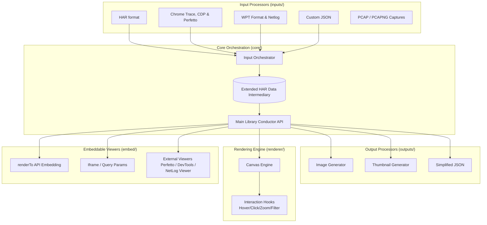

# Waterfall Tools Architecture

## Overview
The Waterfall Tools library is a highly performant, modular, client-side Vanilla JavaScript library for generating, viewing, and analyzing network waterfalls and filmstrips. It takes inspiration from WebPageTest, with an emphasis on performance, zero-bloat, and extensibility.

## Core Principles
- **Intermediary Data Format**: Everything standardizes to an Extended HAR (HTTP Archive) format.
- **Pluggability**: Input processors, output generators, and embeddable viewers are isolated and selectable.
- **Client-Rendered**: Canvas-based rendering with Vanilla JS for optimal performance.
- **Environment Agnostic**: Supports both Browser and Node.js environments where applicable.

## High-Level Architecture



## Directory Structure

```text
/
├── bin/                # CLI entry points and binary wrappers
│   └── waterfall-tools.js # Main CLI executable pulling from Core
├── src/
│   ├── inputs/             # Self-contained modules for processing specific input formats
│   │   ├── cli/            # Standalone CLI tools testing & generating Extended HARs
│   │   ├── utilities/      # Internal parsing pipelines & decoupled bin protocol helpers
│   │   │   └── tcpdump/    # Deep packet inspection modular helpers (TLS, QUIC, TCP/UDP)
│   │   ├── har.js          # Standard HAR passthrough
│   │   ├── chrome-trace.js
│   │   ├── perfetto.js     # Perfetto protobuf binary parser
│   │   ├── wpt-json.js     # WebPageTest pipeline
│   │   ├── netlog.js       # Raw Chrome proxy tracker
│   │   ├── cdp.js          # Chrome DevTools network protocols
│   │   ├── tcpdump.js      # Processes PCAP/PCAPNG packets
│   │   └── orchestrator.js # API for converting chosen input to intermediary HAR
│   ├── outputs/            # Modules for generating various output formats
│   │   ├── image.js        # Waterfall image generation
│   │   ├── thumbnail.js    # Thumbnail generation
│   │   └── simple-json.js  # Simplified request data
│   ├── renderer/           # Waterfall canvas rendering logic
│   │   ├── canvas.js       # Core rendering loop
│   │   ├── layout.js       # Positioning and geometry calculations
│   │   └── interaction.js  # Hooks for hover, click, zoom, filtering
│   ├── embed/              # Website embedding support
│   │   ├── iframe-embed.js # Iframe query param handling
│   │   └── external/       # Wrappers for Perfetto, Chrome DevTools
│   ├── core/               # Shared logic, schemas, and main library conductor
│   │   ├── har-types.js    # Extended HAR conventions
│   │   └── conductor.js    # Main API interface
│   ├── viewer/             # Self-contained, full-featured standalone frontend UI
│   │   ├── index.html      # Main presentation container
│   │   ├── viewer.js       # App controller handling loading, layout routing, drag-and-drop, history API, interactions (tooltips), and generating dynamic Request Detail Tabs
│   │   └── public/         # Self-hosted static dependencies copied natively via Vite
│   │       └── netlog-viewer/ # Standalone compiled Chrome NetLog viewer HTML bundle
│   ├── platforms/          # Environment-specific implementations (e.g., File I/O vs Fetch)
│   │   ├── browser/
│   │   └── node/
│   └── filmstrip/          # (Future) Filmstrip and screenshot processing
├── vite.config.js          # Library build configuration
├── vite.demo.config.js     # Standalone viewer frontend configuration
├── Sample/                 # Sample files and reference implementations
│   ├── Data/               # Sample input files grouped by format (e.g., HAR/source1)
│   └── Implementations/    # Sample python parsing implementations by format
```

## CLI Modes and Testing
Each input format processor acts as an independent module that includes a **stand-alone CLI mode**. The CLI takes a single input file format and generates an output file in the intermediary Extended HAR format. This standalone mode doubles as the primary testing vector: automated tests parse known sample data and assert that the CLI-generated outputs strictly match known-good Extended HAR outputs (after an initial baseline is captured).

## Intermediary Data Format (Extended HAR)
The library uses the standard HAR 1.2 format as a base. Any application-specific data extracted from non-HAR formats (such as Chrome Traces or WPT data) will be stored in fields prefixed with an underscore (`_`), per the HAR specification allowance for custom fields. 

Example:
```json
{
  "log": {
    "version": "1.2",
    "creator": {
      "name": "waterfall-tools",
      "version": "x.x.x"
    },
    "entries": [
      {
        "startedDateTime": "2023-10-01T12:00:00.000Z",
        "time": 50,
        "request": { ... },
        "response": { ... },
        "_initiator": "script.js",
        "_renderBlocking": true,
        "_connectionReused": false
      }
    ]
  }
}
```

### Tcpdump Bandwidth & Chunk Timing
When processing PCAP captures, the tcpdump processor estimates the maximum download bandwidth by running a 100ms sliding window over all server-to-client packets in the capture. This value (in Kbps) is stored as `_bwDown` on the page object, enabling the canvas renderer to calculate per-chunk download durations for granular waterfall visualization. Individual response data chunks from HTTP/1, HTTP/2 DATA frames, and HTTP/3 DATA frames are mapped to `_chunks` arrays with absolute millisecond timestamps and byte counts. HTTP/2 stream priority is parsed from HEADERS frames (when the PRIORITY flag is set) and standalone PRIORITY frames, mapping the weight to Chrome-compatible priority strings (Highest/High/Medium/Low/Lowest). HTTP/3 priority is extracted from the `priority` request header using RFC 9218 Extensible Priorities urgency values. Request overhead (`_bytesOut`) is estimated from serialized request headers, and uncompressed response sizes (`_objectSizeUncompressed`) are tracked when content-encoding decompression produces a different size than the wire bytes.

### Multi-File Archives & OPFS Integration
When processing complex multi-asset packages natively encapsulating several files uniquely (e.g., `wptagent` ZIP archives chaining JSON traces, netlogs, and screenshots), parsers MUST mitigate memory bloat forcefully. The architecture seamlessly utilizes the Web **Origin Private File System (OPFS)** natively paired dynamically with the `Web Locks API`. This bridges native unzipped file assets precisely through `data._opfsStorage` and `data._zipFiles` boundaries inherently, granting the main library unified mechanisms (`getPageResource()`) to securely map isolated Blob URLs natively to images or raw string chunks efficiently dynamically on-demand, without permanently unpacking and exhausting available RAM natively.

#### Nested Response Bodies (`_bodies.zip`)
WPTAgent ZIP archives contain nested `[run]_bodies.zip` (and `[run]_Cached_bodies.zip`) archives holding individual response body files. Each request in `devtools_requests.json` references its body via the `body_file` field (e.g., `001-<id>-body.txt`). During processing, the wptagent parser extracts these nested zips into temporary storage, reads each referenced body file, base64-encodes the content, and stores it on the HAR entry's `response.content.text` with `encoding: 'base64'`. The temporary storage is destroyed immediately after extraction to minimize memory usage.

## Rendering Engine
The renderer uses the native HTML5 `<canvas>` API rather than the DOM (e.g., creating hundreds of `<div>` tags) to ensure that rendering thousands of requests doesn't cause browser layout trashing. The canvas engine is completely autonomous, instantiated against a parent container div where it utilizes native `ResizeObserver` instances to self-recalculate structural geometric bounds responsive to viewport changes perfectly. Interaction is handled by maintaining a spatial index of drawn elements and mapping mouse coordinates to data entries. Application logic overrides can be supplied via robust hook events system injected into the render core. It natively supports specialized rendering modes (e.g., **Connection View** for multiplexing visualization, or **Thumbnail View** for dense overviews) configurable via standard render option primitives. Since HAR files can natively contain multiple pages (such as First View and Repeat View runs from WebPageTest), the rendering engine assumes callers actively filter the global pool of request entries to specifically match only the single active page ID before passing them to the rendering loop natively.

## Embeddable Components
The architecture natively accommodates integration directly securely into web apps. The `WaterfallTools.renderTo(containerElement, options)` API handles deep integrations organically, superseding any separate `div-embed.js` boilerplate. IFrame configurations rely on structured message passing or parsed query parameters for headless integration with data resources. 

## Build and Bundling
The project should use a modern bundler like Vite or Rollup to package the library into modular ES Modules (ESM) and Universal Module Definition (UMD). The configuration must strictly support tree-shaking, removing irrelevant target platforms and components statically—so a web integration need only load the browser-renderer subsets minus node endpoints. Native APIs are favored, seamlessly scaling up to WASM when computationally expensive image/video evaluations are invoked.
